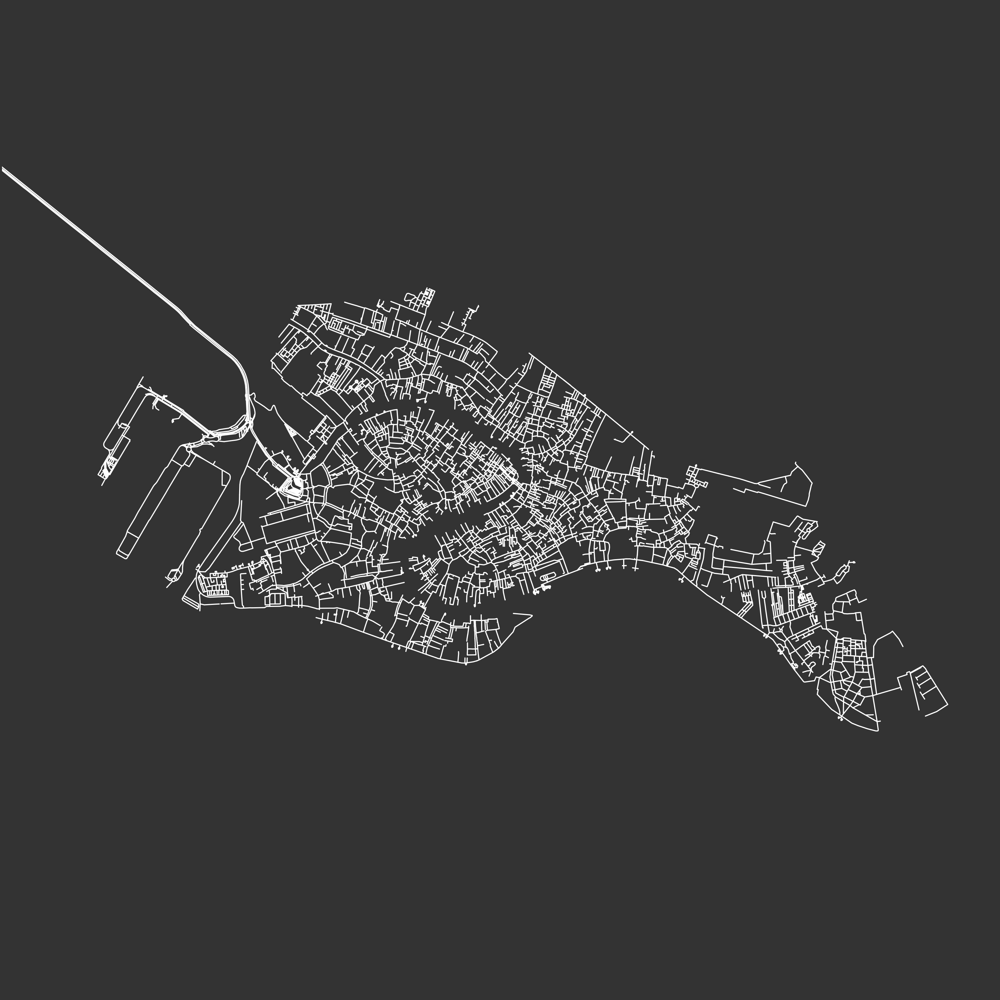

# Maps app

  
   
  

This is a Streamlit app to easily create a nice city map image, downloadable as PDF without need to code.

You can choose the background and streets colors, the radius length. If you like the displayed preview you can just download the PDF pressing the download button.

It can take few minutes to display depending on how many streets there are in the city. So the higher the radius, the slower it will be. Be patient.

