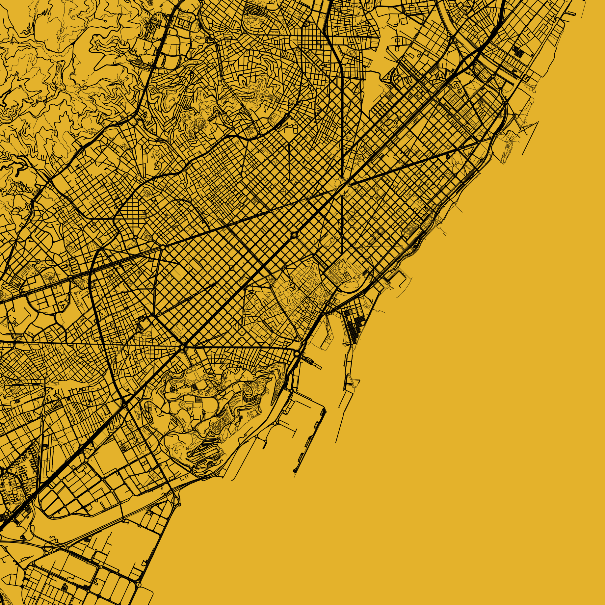
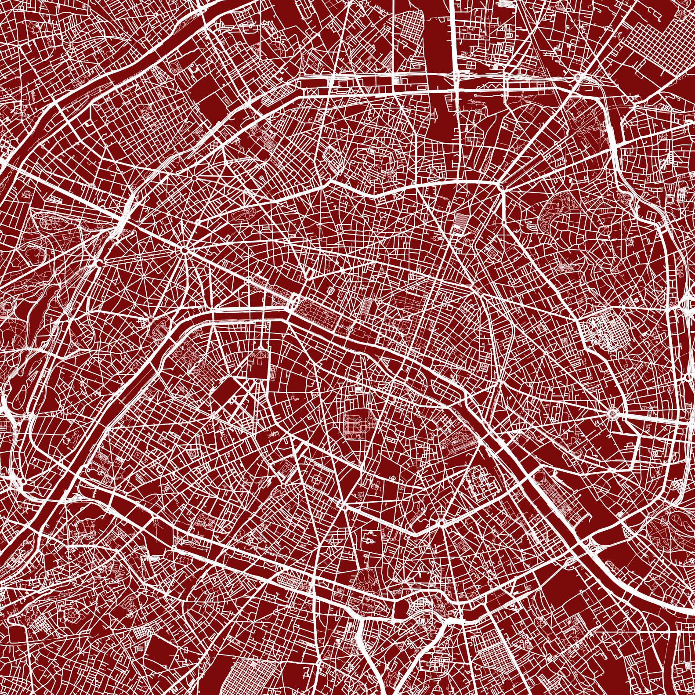

# City maps app

This is a Streamlit app to easily create a nice city map images, downloadable as PDF without the need to code.

<p float="left">
  
   
  
  
</p>


The app is running on [Huggin Face](https://huggingface.co/spaces/Priante/city_maps_app), but you can also run it locally with the instruction at the bottom of the page.

You can choose the background and streets colors, the radius length. If you like the displayed preview you can just download the PDF pressing the download button.

It can take few minutes to display depending on how many streets there are in the city. So the higher the radius, the slower it can be.


# Installation instructions
1. Clone the repository:
```sh
git clone https://github.com/FraPria/city_maps_app.git
```

2. install the requirments:
```sh
cd city_maps_app
pip install -r requirements.txt
```

3. Run the code with:
```sh
streamlit run app_map.py 
```
This command will prompt the Local URL where you can find your app running. So open up the browser and paste the URL.